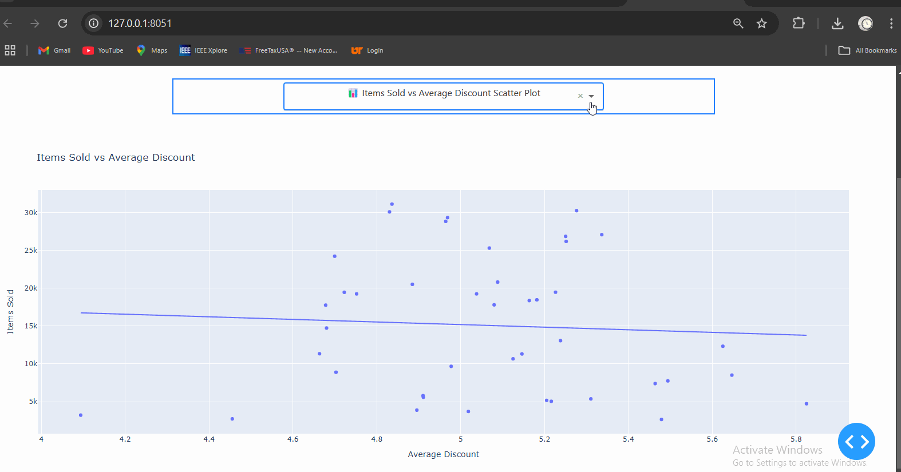

# Feature Store and Dashboard Project

## Overview

This project aims to create an automated feature store system that:
1. Fetches data from an external API.
2. Stores the data in a local CSV file.
3. Loads the data into a PostgreSQL database.
4. Provides an interactive web dashboard displaying key metrics and trends using **Dash**.

### Key Components:
- **Data Fetching & Processing**: Fetches data from an external API and processes it.
- **Database Integration**: Loads the fetched data into a PostgreSQL database.
- **Web Dashboard**: An interactive dashboard for visualizing the data and trends.

## Requirements

Ensure you have the following Python libraries installed:

```bash
pip install pandas requests psycopg2 sqlalchemy flask dash dash-bootstrap-components plotly python-dotenv schedule
```

## System Components

### 1. **Data Fetching & Saving**
This component fetches data from an API and saves it into a CSV file (`feature_store.csv`).

- **File**: `data_fetching.py`
- **Functionality**:
  - Fetches data from a remote server via an API.
  - Saves new data to a CSV file, avoiding duplicates based on keys (`salesdate`, `productid`, `region`).
  - Logs all actions and updates in a log file (`feature_store_log.log`).

### 2. **Flask API Server**
The Flask API serves the data to be consumed by other parts of the system (such as the dashboard or database integration).

- **File**: `api_server.py`
- **Functionality**:
  - Provides a RESTful API to retrieve the feature store data in JSON format.
  - Runs on port 5000 by default.

### 3. **Database Integration**
This component loads the fetched data into a PostgreSQL database.

- **File**: `database_loader.py`
- **Functionality**:
  - Fetches data from the API.
  - Connects to a PostgreSQL database using `psycopg2`.
  - Inserts the fetched data into the `feature_store` table of the database.
  - Creates the table if it does not exist.

### 4. **Dash Dashboard**
The interactive dashboard provides data visualizations, showing trends and metrics like sales and discounts by region and day of the week.
This is how the Dashboard looks like 

- **File**: `dashboard.py`
- **Functionality**:
  - Retrieves the data from the PostgreSQL database.
  - Visualizes the data using Plotly charts.
  - Displays trends such as:
    - Total items sold per weekday.
    - Mean items sold per region by day of the week.
    - Daily sales and discounts.

### 5. **Environment Variables**
Store sensitive information like the database connection details in a `.env` file.

- **File**: `.env`
- **Example Content**:
  ```
  DB_HOST=your_db_host
  DB_NAME=your_db_name
  DB_USER=your_db_user
  DB_PASSWORD=your_db_password
  ```

---

## Running the System

### Step 1: Set up the environment
Ensure that you have set up the required libraries and environment variables as described in the Requirements section.

1. Create a `.env` file and add your database credentials.
2. Install the required dependencies via `pip install -r requirements.txt`.

### Step 2: Fetch and Save Data
Run the `data_fetching.py` script to fetch new data from the API and save it to the CSV file.

```bash
python data_fetching.py
```

### Step 3: Start the Flask API Server
Run the Flask API server to expose the data via REST API.

```bash
python api_server.py
```

### Step 4: Load Data into the Database
Run the `database_loader.py` script to fetch the data from the API and load it into the PostgreSQL database.

```bash
python database_loader.py
```

### Step 5: Launch the Dashboard
Run the Dash dashboard to start the interactive web app.

```bash
python dashboard.py
```

Visit `http://127.0.0.1:8050/` in your browser to view the dashboard.

---

## Data Schema

The `feature_store` table in the PostgreSQL database has the following structure:

| Column Name  | Type      | Description                                  |
|--------------|-----------|----------------------------------------------|
| `salesdate`  | DATE      | The date of the sales transaction            |
| `productid`  | INT       | The product ID                              |
| `region`     | TEXT      | The region where the sale occurred           |
| `freeship`   | BOOLEAN   | Whether the item was shipped for free        |
| `discount`   | FLOAT     | The discount applied to the sale             |
| `itemssold`  | INT       | The number of items sold                     |
| `update_time`| TIMESTAMP | The timestamp when the data was updated      |

---

## Dashboard Features

The **Dash Dashboard** displays the following key metrics:

1. **Total Items Sold Per Weekday**:
   A bar chart showing the total items sold for each day of the week.

2. **Mean Items Sold Per Region and Weekday**:
   A heatmap displaying the average items sold per region, segmented by weekday.

3. **Daily Sales Trends**:
   Line charts showing total items sold and average discount applied per day.

4. **Median Items Sold by Region and Free Shipping Status**:
   A table displaying the median number of items sold by region, grouped by whether the item was shipped for free.

---

## Logging

The system logs its operations, including errors and data fetch successes, to a log file (`feature_store_log.log`).

---

## Contributing

Feel free to submit issues or pull requests to improve the system. You can contribute by:

- Enhancing the data fetching mechanism.
- Adding more visualizations to the Dash dashboard.
- Optimizing the database load process.

---


